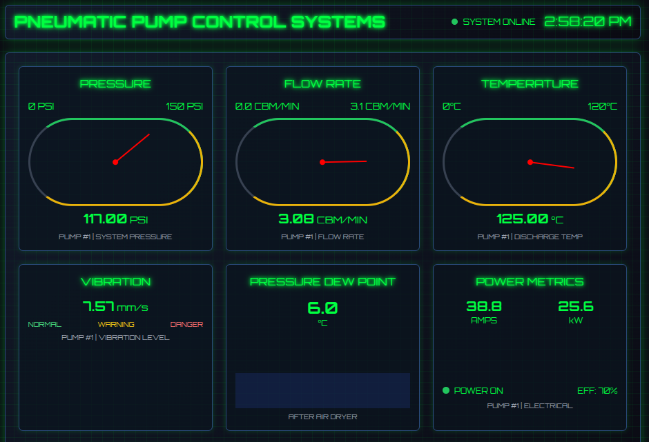

# ซอร์สโค้ดนี้ ใช้สำหรับเป็นตัวอย่างเท่านั้น ถ้านำไปใช้งานจริง ผู้ใช้ต้องจัดการเรื่องความปลอดภัย และ ประสิทธิภาพด้วยตัวเอง

# PneuMonitor

PneuMonitor is a real-time, retro-themed web-based dashboard for monitoring the operational status of a pneumatic pump system. It simulates data from a hardware device and displays key metrics in a user interface reminiscent of an 80s fighter jet cockpit.



## How It Works

The project is composed of two main parts:

1.  **Hardware Simulator (`hardware-simulator/index.js`):** A Node.js script that generates random data for various pump metrics (pressure, flow rate, temperature, etc.). It then publishes this data to an MQTT message broker under the topic `pneu/data`.

2.  **Web Application (Server: `index.js`, Frontend: `src/`):**
    *   The Node.js/Express server (`index.js`) serves the static frontend files.
    *   It connects to the MQTT broker and subscribes to the `pneu/data` topic.
    *   Using Socket.IO, it relays the data received from the MQTT topic in real-time to all connected web clients.
    *   The frontend (`src/index.html` and `src/script.js`) receives the data via Socket.IO and dynamically updates the gauges, charts, and readouts on the dashboard.

## Features

-   Real-time monitoring of pneumatic pump metrics.
-   Retro 80s fighter cockpit-style user interface.
-   Gauges for Pressure, Flow Rate, and Temperature.
-   Digital readouts for Vibration, Pressure Dew Point, and Current/Power.
-   System status indicators and alerts.

## Technologies Used

-   **Backend:** Node.js, Express.js
-   **Frontend:** HTML, Tailwind CSS, JavaScript
-   **Real-time Communication:** Socket.IO, MQTT
-   **Simulator:** Node.js

## Setup and Installation

To run this project, you will need Node.js and an MQTT broker (like [Mosquitto](https://mosquitto.org/)) installed.

1.  **Clone the repository:**
    ```bash
    git clone <repository-url>
    ```

2.  **Install dependencies for the main application:**
    ```bash
    npm install
    ```

3.  **Install dependencies for the hardware simulator:**
    ```bash
    cd hardware-simulator
    npm install
    cd ..
    ```

## Running the Application

1.  **Start your MQTT broker.** If you are using Mosquitto, you can typically run it as a service or execute the `mosquitto` command.

2.  **Start the hardware simulator:**
    Open a new terminal and run:
    ```bash
    node hardware-simulator/index.js
    ```
    You should see log messages indicating it has connected to the MQTT broker and is publishing data.

3.  **Start the web server:**
    In another terminal, run:
    ```bash
    node index.js
    ```
    The server will start on `http://localhost:3000`.

4.  **View the dashboard:**
    Open your web browser and navigate to [http://localhost:3000](http://localhost:3000). You should see the dashboard updating in real-time with the data from the simulator.
